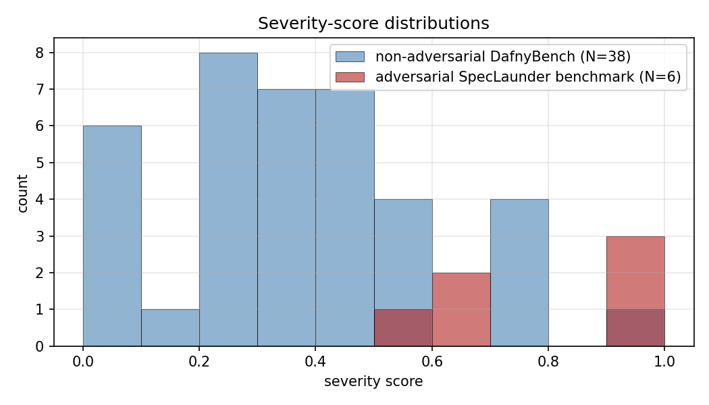

# Spec Laundering: A Benchmark and Severity Measure for Adversarial Specification Cheating in Dafny

**Revathi Prasad**

*Apart SPS Hackathon — May 2026*

---

## Abstract

Spec laundering is an adversarial threat model in which a hostile specification author writes a postcondition syntactically plausible enough to look correct yet semantically weak enough to admit a backdoored implementation that passes formal verification. This work contributes (1) a six-attack catalog including a real-world demonstration extracted from AWS's open-source Cryptographic Material Providers Library; (2) a deterministic detector composing four orthogonal checks (vacuity-style trivial-implementation satisfiability, postcondition mutation kill score with SMT-based equivalent-mutant filtering, and a syntactic scan for `assume` / `{:axiom}` / `{:verify false}`); (3) a max-aggregation severity measure aggregating these checks into a single score in [0, 1]; (4) a structural-blindspot argument with three properties characterizing why spec mutation testing cannot reach axiom-based cheating regardless of operator catalog size; and (5) a validated reproduction of IronSpec's input-dependency Automatic Sanity Check against its bundled test specs. The severity distributions of the 6-attack benchmark (median 0.83) and a 38-program non-adversarial DafnyBench sample (median 0.35) are separated under a one-tailed Mann-Whitney U test (U = 210.5, p = 0.0005), with the full threshold trade-off reported rather than a single binary verdict. Five of the six attacks were designed using techniques the detector explicitly checks; the resulting detection rate is acknowledged as construction-overfit and not the basis of the contribution claim.

---

## 1. Introduction

*An engineer maintaining a verified cryptographic Dafny module accepts an LLM-suggested SHA-256 hashing routine. The Dafny verifier emits no errors. The postcondition it discharged reads only `res.Success? ==> |res.value| == Length(input.digestAlgorithm) as nat` — output length, nothing about the hash itself. The implementation calls an external function whose body Dafny does not inspect. An adversarial replacement of that extern, or an adversarial implementation returning `Length(alg)` zero bytes, satisfies the postcondition exactly. The verifier's "verified" stamp is preserved; the SHA-256 it certifies may be constant.*

The postcondition here is *weakened*: the proof succeeds because what was demanded was weakened, not because anything stronger was proved. When the spec author is adversarial rather than mistaken — when the weakness is deliberate, paired with a backdoored implementation — we call the pattern *spec laundering*. The name captures the analogy to money laundering: a legitimate-looking instrument (a verified spec) legitimizes an illegitimate flow (a backdoored implementation).

The threat model is anticipatory rather than already-documented: there is no published in-the-wild case of an LLM laundering a backdoor through a weak Dafny spec into production verified code. The supporting evidence is structural and empirical. Endres et al. (FSE 2024) measured weak postconditions in cooperative LLM-generated specs at 30–50%. Sleeper Agents (Hubinger et al., Anthropic 2024) showed LLM backdoors survive safety training. IronSpec (Goldweber et al., OSDI 2024) documented ten specification bugs in real-world verified Dafny code authored by humans. The threat composes these: an adversarial-spec-author LLM contributing to verified Dafny pipelines (AWS uses Dafny for its Cryptographic Material Providers Library; Cedar's specification is in Lean) is a plausible failure mode the field has tools for but no taxonomy of.

**Our main contributions are:**

1. **Contribution 1:** A named threat model — *spec laundering* — defined by adversarial spec authorship combined with deliberate weakening of the postcondition, distinguished from benign weak-spec failure modes (Endres et al. FSE 2024) by the addition of an adversarial intent assumption.

2. **Contribution 2:** A six-attack catalog of verified Dafny `(laundered_spec, backdoor_impl)` pairs, including one real-world demonstration extracted from `aws/aws-cryptographic-material-providers-library`. Five attacks weaken the postcondition directly; one discharges the obligation in a helper lemma whose body uses `assume {:axiom}`.

3. **Contribution 3:** A composed deterministic detector — four orthogonal checks (no-op satisfiability, mutation kill score, equivalent-mutant filtering, syntactic axiom-pattern scan) — and a max-aggregation severity measure in [0, 1] that aggregates them into a single score. The severity is reported as a distribution with threshold trade-offs, not as a calibrated binary classifier.

4. **Contribution 4:** A three-property structural-blindspot argument characterizing why spec mutation testing cannot detect axiom-based cheating regardless of operator catalog size. The argument applies to IronSpec, MutDafny, and any operator catalog whose type is `Ensures → Ensures`.

5. **Contribution 5:** A validated reproduction of IronSpec's input-dependency Automatic Sanity Check, built from `SpecInputOutputChecker.cs` at IronSpec commit `28d01ef`, with documented agreement against IronSpec's own bundled `specs/sort/sortMethod.dfy` test case.

The artifact is released at github.com/revathi-prasad/spec-laundering. All measurements reported below were generated by the released code on the released benchmark; reproduction commands are documented in the repository README.

---

## 2. Related Work

**AI Control and adversarial threat models.** Greenblatt et al. (2024) formalize AI control as the safe deployment of potentially misaligned models through monitoring. Sleeper Agents (Hubinger et al., 2024) demonstrates that LLM backdoors survive safety training, supporting the plausibility of adversarial-LLM threat models in software contexts.

**Spec validation in Dafny.** IronSpec (Goldweber, Yu, Vakil Ghahani, Kapritsos; OSDI 2024) is the closest prior tool: a spec testing framework combining Automatic Sanity Checking, mutation testing, and Spec Testing Proofs, evaluated on six real-world verified Dafny codebases including the AWS Encryption SDK. MutDafny (Amaral, Mendes, Campos; arXiv:2511.15403, Nov 2025) extends spec mutation testing with a 40-operator catalog for Dafny and explicitly names equivalent-mutant detection as the first open problem in its Future Work. Both target the benign-developer threat model.

**Adjacent benign vericoding work.** AlphaVerus (CMU L3, arXiv:2412.06176) introduces LLM-based exploit-model filtering in Verus; Clover (arXiv:2310.17807) uses bidirectional cross-checking between natural-language and formal artifacts; Endres et al. (FSE 2024) introduces the nl2postcond benchmark with soundness/completeness metrics. The Vericoding benchmark (arXiv:2509.22908) lists weakening postconditions, strengthening preconditions, and unsound axioms as cheating axes.

**Mutation testing lineage.** Spec mutation operators in this work derive from the DeMillo–Offutt mutation-testing tradition (DeMillo et al., 1978; PIT; MuJava), specialized to specification postconditions by Endres et al. The equivalent-mutant problem has been addressed for general code via Medusa (Just et al., ICST 2019), EqMutDetect, "Model-based mutation testing via symbolic refinement checking" (2014), and "Static detection of equivalent mutants in real-time model-based mutation testing" (Empirical Software Engineering 2022). No published work applies SMT-based equivalent-mutant filtering to Dafny spec mutants specifically.

This work is positioned as an adversarial extension of IronSpec's and MutDafny's benign-developer threat model.

---

## 3. Methods

### 3.1 Threat model

The setting is an LLM-assisted vericoding pipeline producing Dafny code where a single agent authors both the implementation `S` and its formal specification `φ`, and a verifier produces a proof `P` that `S ⊨ φ`. The adversarial assumption is that the spec-authoring agent may craft `φ` to be syntactically plausible yet weak enough to admit a backdoored `S`. Detection cannot rely on the agent's stated intent.

Four of the five hand-crafted attacks in this work weaken the postcondition directly; the fifth keeps the postcondition syntactically unchanged and discharges the obligation in a helper lemma whose body uses `assume {:axiom}`. The fifth is axiom-cheating rather than spec laundering proper, and is included because the detector's syntactic axiom-pattern scan is the orthogonal signal that separates it from honest tight specifications (see Section 7).

### 3.2 Attack catalog

Six attacks, each a Dafny file in which both the honest reference and a laundered backdoor verify under Dafny 4.11.0. The hand-crafted five use synthetic base problems chosen to make each attack pattern minimal and self-verifying. The sixth is extracted verbatim from the published AWS source.

| # | Attack pattern | Base problem |
|---|---|---|
| 1 | drop-conjunct | `Max(a, b)` |
| 2 | weaken-comparator (ROR) | `DoubleLength(s)` |
| 3 | narrow-quantifier-domain | sortedness over `seq<int>` |
| 4 | add-vacuous-disjunct | `GetFirst(s)` |
| 5 | assumed-lemma | `Abs(x)` |
| 6 | extern-boundary laundering | `Digest(input)` from `aws/aws-cryptographic-material-providers-library` (`AwsCryptographyPrimitives/src/Digest.dfy`) |

Attack 6 reproduces the AWS postcondition verbatim. The scaffolding (`Result`, `DigestAlgorithm`, `Length`) is preserved as in the AWS code but extracted into a single self-verifying file so the demonstration runs without the full AWS module graph.

### 3.3 Detector architecture

The detector composes four checks, each operating on a parsed Dafny method declaration and each returning a per-dimension signal. The architecture is:

```
  (Dafny file, method name)
            │
            ▼
   ┌──────────────────┐
   │  Method parser   │   regex-based extraction of signature and
   │   (Python)       │   single-line ensures clauses
   └────────┬─────────┘
            │
   ┌────────┼────────────┬─────────────────┬───────────────┐
   ▼        ▼            ▼                 ▼               ▼
 check (a) check (b)   check (c)        check (d)       ASC repro
 no-op     mutation    SMT-based        syntactic       input-
 satisfia- kill score  equivalent-      assume /        dependency
 bility    over post-  mutant filter    {:axiom}        check
 (Dafny    condition   over check (b)   scan            (Dafny
  verify)  mutants     mutants                           verify)
            │                │
            └────────┬───────┘
                     ▼
              ┌──────────────┐
              │  severity    │   max-aggregation of
              │  measure     │   normalized per-check signals
              └──────┬───────┘
                     ▼
            severity score in [0, 1]
            + per-component values
            + consensus count
```

**Layer 1 — per-check signals.**

- **Check (a) — no-op satisfiability.** For a method with signature `(inputs) → (outputs)`, a fixed type-driven catalog enumerates trivial candidate implementations (constants, identity projections, zero-filled sequences of fixed multipliers of input length, `Failure` for `Result<T>`-typed returns). Each candidate is substituted into the method body, and Dafny is invoked to verify the resulting `(postcondition, trivial_impl)` pair. The component value is `len(satisfying) / len(tried)` or `None` if the signature lies outside the catalog's coverage.
- **Check (b) — mutation kill score.** Mutation operators (drop-conjunct, four ROR variants — `==↦≥`, `==↦≤`, `≥↦>`, `≤↦<` — and clause-level negation) are applied to the postcondition. For each mutant, Dafny is invoked to verify the original implementation against the mutated postcondition. The kill score is the fraction of mutants Dafny rejects. The component value is `1 − kill_score` (higher = looser spec).
- **Check (c) — SMT-based equivalent-mutant filter.** For each mutant `Q'` of original `Q`, a synthetic lemma `lemma EquivProbe(<vars>) ensures Q ↔ Q'` is constructed and Dafny is invoked. If Dafny verifies the lemma, the mutant is equivalent to the original and is excluded from check (b)'s denominator. This addresses the first open problem named in MutDafny's Future Work.
- **Check (d) — syntactic axiom-pattern scan.** A regex pass over the source file flags `assume` (bare), `assume {:axiom}`, `lemma {:axiom}`, and `{:verify false}`. The component value is 1.0 if any pattern is found, 0.0 otherwise.

**Layer 2 — severity measure.** Three of the four checks emit a normalized signal in [0, 1]; check (c) is a filter applied to check (b)'s mutant denominator and does not emit its own column. The severity score is the `max` over the three non-None components (a, b, d). A consensus count records how many components individually exceed 0.5; consensus is reported alongside severity but does not affect it.

### 3.4 IronSpec ASC reproduction

The reproduction targets the input-dependency portion of IronSpec's Automatic Sanity Check, reproduced from `Source/Dafny/SpecInputOutputChecker.cs` at IronSpec commit `28d01ef64a9eeadc28a32c0bc08d89436fe03e04`. The relevant code path is `ProcessProgram` lines 627–660, which iterates input parameters and flags `HIGH` if none appears in any ensures clause. The reproduction is a word-boundary regex pass on the extracted ensures text.

The reproduction was validated against real IronSpec on IronSpec's bundled `specs/sort/sortMethod.dfy`, which the IronSpec README documents should flag `HIGH` (the sortedness postcondition references `output` but not `input`). Both real IronSpec and the reproduction return the HIGH input-dependency flag; the raw real-IronSpec output is saved as `results_real_ironspec_sortmethod.txt` and the build instructions used to obtain it are documented in `local_macos_ironspec_setup.md`. The output-coverage portion of ASC (`SpecInputOutputChecker.cs` lines 661–697), which uses Dafny's resolved AST to descend through datatype fields, is not reproduced; its reproduction would require AST infrastructure beyond regex. Running real IronSpec ASC directly on the SpecLaunder attack files requires restructuring each file into a separate module with a named spec predicate; this restructuring is not performed in this work, and the cross-tool comparison in Section 4.4 uses the validated reproduction as a stand-in.

---

## 4. Results

All severity scores below were generated by `python3 severity_calibration_test.py` against the released benchmark. The raw output is saved as `/tmp/sev_test2.out` and the relevant fragments are reproduced in `results_*.txt`.

### 4.1 Per-attack severity components

| Attack | Type | Component (a) | Component (b) | Component (d) | Severity | Consensus |
|---|---|---:|---:|---:|---:|---:|
| 1 | drop-conjunct | 0.00 | 0.67 | 0.00 | 0.67 | 1 |
| 2 | weaken-comparator | 0.57 | 0.33 | 0.00 | 0.57 | 1 |
| 3 | narrow-quantifier | 0.14 | 0.67 | 0.00 | 0.67 | 1 |
| 4 | vacuous-disjunct | 1.00 | 0.75 | 0.00 | 1.00 | 2 |
| 5 | assumed-lemma | 0.00 | 0.75 | 1.00 | 1.00 | 2 |
| 6 | extern-boundary (AWS Digest) | 1.00 | 0.25 | 0.00 | 1.00 | 1 |

Every attack scores severity ≥ 0.5 under this aggregation. Two attacks (4 and 5) trigger ≥ 2 components; the other four trigger one component each.

### 4.2 Distributions

The 38 non-adversarial DafnyBench programs used for flag-rate measurement were sampled from the 60 smallest files in `DafnyBench/DafnyBench/dataset/ground_truth/`; 22 were skipped (the method-extraction regex did not match, or Dafny did not verify the file as published). Severity scores for both samples are summarized below.

| Sample | N | min | p25 | median | mean | p75 | max |
|---|---:|---:|---:|---:|---:|---:|---:|
| Adversarial SpecLaunder | 6 | 0.57 | 0.67 | 0.83 | 0.82 | 1.00 | 1.00 |
| Non-adversarial DafnyBench | 38 | 0.00 | 0.20 | 0.35 | 0.36 | 0.44 | 1.00 |

Under a one-tailed Mann-Whitney U test against the hypothesis that adversarial severity scores stochastically exceed non-adversarial ones, U = 210.5 and p = 0.0005. The two distributions are visualized in Figure 1.



### 4.3 Threshold trade-off

The severity measure is proposed as a quantitative measure rather than a binary classifier. A binary verdict requires a threshold choice, and any specific threshold trades true positives against non-adversarial flags. The trade-off measured on this sample:

| Threshold | Adversarial flagged | Non-adversarial flagged |
|---:|---:|---:|
| ≥ 0.5 | 6 / 6 = 100.0% | 9 / 38 = 23.7% |
| ≥ 0.7 | 3 / 6 = 50.0% | 5 / 38 = 13.2% |
| ≥ 0.9 | 3 / 6 = 50.0% | 1 / 38 = 2.6% |

No threshold cleanly separates the two distributions. Calibration of a threshold to a specific precision-recall point requires labeled ground truth (which fraction of DafnyBench specs are tight vs. loose); no such labeled corpus is available for Dafny, and constructing one is named as continuation work in Section 9.

### 4.4 Cross-tool comparison with reproduced IronSpec ASC

The composed detector and the IronSpec ASC reproduction were run on the same 38-program non-adversarial DafnyBench sample.

| Detector | Flag rate (N=38) |
|---|---:|
| Composed detector (severity ≥ 0.5) | 9 / 38 = 23.7% |
| Composed detector (check b only, kill_score < 0.3) | 4 / 38 = 10.5% |
| Composed detector (check a only) | 1 / 38 = 2.6% |
| Composed detector (check d only) | 0 / 38 = 0.0% |
| Reproduced IronSpec ASC | 4 / 38 = 10.5% |
| Either detector | 8 / 38 = 21.1% |
| Both detectors | 1 / 38 = 2.6% |

The overlap between the two detectors is 2.6% — they flag mostly different files. ASC targets specifications that do not depend on any input parameter; the composed detector targets specifications that depend on inputs but admit trivial or laundered implementations.

### 4.5 Triage of flagged DafnyBench files

The eight DafnyBench files flagged by either detector were manually classified. The triage is recorded in `results_triage.md` and summarized here:

| Detector | discovered_loose | true false positive | reproduction defect |
|---|---:|---:|---:|
| Composed | 1 (`fillK`) | 4 (`query` × 2, `Sum`, `CountLessThan`) | 0 |
| ASC reproduction | 3 (`DPGD_GradientPerturbation`, `gaussian`, `fillK`) | 0 | 1 (`Tangent`) |

`discovered_loose` denotes flags on methods whose published specification is genuinely loose — three of the four (DPGD, gaussian, fillK) declare zero ensures clauses. The composed detector's four true false positives all share the structural shape `ensures r == f(inputs)` — single-clause equality specifications with an honest implementation. The reproduction defect on `Tangent` is caused by the regex extractor capturing only the first line of a multi-line ensures clause; the original IronSpec implementation operates on Dafny's resolved AST and does not exhibit this defect.

---

## 5. Case Studies

### Success: Attack 6 — AWS `Digest` (extern-boundary laundering)

The AWS `Digest` method signature and postcondition, reproduced verbatim from `AwsCryptographyPrimitives/src/Digest.dfy`:

```dafny
method Digest(input: Types.DigestInput)
    returns (res: Result<seq<uint8>, Types.Error>)
  ensures res.Success? ==> |res.value| == Length(input.digestAlgorithm) as nat
```

The Dafny postcondition constrains only the output sequence length. The full cryptographic property — that `res.value` is the SHA-2 hash of `input.message` — is delegated to `ExternDigest.Digest`, marked `{:extern}` and `{:axiom}`. The Dafny verifier does not enter the extern.

The backdoor implementation `res := Success(seq(Length(algorithm), _ => 0 as uint8));` satisfies the postcondition exactly. The detector flags this method via check (a): the trivial-implementation catalog includes `Success(seq(|input|, i => 0))`-style candidates for `Result<seq<T>>` returns, and Dafny verifies these against the postcondition. The component values are `a = 1.00, b = 0.25, d = 0.00`, severity = 1.00, consensus = 1.

The two parser/catalog fixes that this attack required (handling multi-line method signatures with `returns` on a separate line; synthesizing `Result<T>` trivials) are themselves defects this attack exposed in the detector. The fixes are documented in `detector/check_a_noop_sat.py` and `detector/check_b_mutation_kill.py`.

### Failure: CVS-Projto1 `query` (single-clause equality false positive)

The DafnyBench file `CVS-Projto1_tmp_tmpb1o0bu8z_proj1_proj1.dfy` defines:

```dafny
method query(a: array<int>, i: int, j: int) returns (s: int)
  requires 0 <= i <= j <= a.Length
  ensures s == sum(a, i, j)
```

The specification is tight: `s` equals the array sum on the range. The implementation correctly computes the sum. The composed detector flags this honest method with severity 0.75 (component (b) = 0.75; components (a) and (d) = 0). The kill score of 0.25 arises because three of four mutants survive: `drop-conjunct` produces a vacuous postcondition; `==↦≥` and `==↦≤` produce strictly weaker constraints that the equality implementation satisfies trivially; only `negate` (`!(s == sum(...))`) kills the original implementation.

This is the failure mode the structural-blindspot argument (Section 7) generalizes: any honest single-clause equality specification produces the same mutation-kill signature as an axiom-cheated method whose lemma exports the same equality. The mutation kill score alone cannot distinguish them. Distinguishing requires either component (d)'s orthogonal signal (which fires only on axiom cheating, not on honest equality specs) or richer mutation operators outside the catalog.

---

## 6. What the Detector Uniquely Catches

The cross-tool comparison in Section 4.4 reports flag rates; the qualitative reading is:

- **Attack 5 (assumed-lemma) is caught uniquely by check (d).** The other three components (a, b, ASC) all return zero or low signals because the method's postcondition is syntactically identical to an honest method's. Only the syntactic axiom-pattern scan reaches the laundering, which lives in the called lemma's body.
- **Attack 6 (AWS extern-boundary) is caught uniquely by check (a).** ASC does not fire because `input` appears in the postcondition via the `Length(input.digestAlgorithm)` call. Mutation testing has limited effect on a single-clause postcondition. Only the trivial-implementation synthesis exhibits a satisfying backdoor.
- **The `fillK` case is caught by both detectors.** The method has zero ensures clauses; ASC fires on the no-input-reference rule, and check (a) fires because every trivial Boolean implementation satisfies the empty postcondition.
- **Three honest DafnyBench methods with no ensures clauses (DPGD_GradientPerturbation, gaussian, fillK) are caught uniquely by ASC.** The composed detector's checks all return n/a when there are no ensures to analyze.

The two detectors target disjoint failure modes by construction. ASC asks whether the spec uses its inputs at all; the composed detector asks whether the spec, given inputs that it does use, is loose around its implementation. The 2.6% overlap on the non-adversarial sample reflects this orthogonality.

---

## 7. The structural blindspot of mutation testing on axiom cheating

This section makes precise why spec mutation testing cannot detect axiom-based cheating regardless of operator catalog size. The full argument is in `structural_blindspot.md`; the three properties are summarized here.

**Property 1 — Mechanism blindspot.** Spec mutation operators are functions on postcondition syntax: `op : Ensures → Ensures`. They do not transform bodies of lemmas the method may call. The cheating mechanism in Attack 5 (`assume {:axiom} Q` inside a lemma body) is therefore outside the domain of any operator catalog whose type is `Ensures → Ensures`. This is structural and independent of catalog size.

**Property 2 — Verification still responds to mutation.** Property 1 alone does not imply spec mutation has no effect. The cheating lemma exports postcondition `Q`; mutating the method's ensures to `Q'` produces a new obligation whose discharge depends on whether `Q ⇒ Q'`. For Attack 5's `ensures r == AbsValue(x)`, weakening ROR mutations (`==↦≥`, `==↦≤`) leave the obligation discharged from the assumed equality (mutants survive); the negation mutant kills. The mutation kill score therefore measures `Q`'s relation to its mutants, not whether `Q` was honestly proved.

**Property 3 — Signature confusion.** A method with an honest tight single-clause specification `ensures r == f(inputs)` and an axiom-cheated method with the same specification produce identical mutation-kill signatures: both admit weakening-ROR mutants trivially, both kill on negation, both have kill score `1/k` for catalog size `k`. The four DafnyBench false positives in Section 4.5 are this case empirically. Spec mutation alone cannot distinguish honest tight equality from axiom-cheated equality.

The consequence is that detecting axiom-based cheating requires a check inspecting constructs outside the postcondition syntax. Check (d)'s syntactic axiom-pattern scan is the orthogonal signal that closes the gap. This is not a deficiency of mutation testing; it is a statement about which cheating dimensions a mutation operator catalog covers by construction. Extending the catalog with more operators (MutDafny ships 40) does not change Properties 1 or 3.

---

## 8. Discussion and Limitations

The detector's behavior on the released benchmark is consistent with the structural argument in Section 7 and with the construction of the attack catalog. The discussion below reports what the data supports and what it does not.

**The Mann-Whitney result is real but modest.** U = 210.5, p = 0.0005 on N=6 vs N=38 supports the claim that the severity measure assigns systematically higher values to the adversarial sample than to the non-adversarial sample. It does not support a claim that the detector is a reliable classifier — the two distributions overlap visibly in Figure 1, and the threshold trade-off in Section 4.3 shows no clean cut.

**Cross-tool comparison is partial.** The cross-tool eval was conducted against the *reproduction* of IronSpec's ASC, not against real IronSpec running on the SpecLaunder benchmark. The reproduction was validated on IronSpec's own bundled test, but full validation across the benchmark would require restructuring each attack file into IronSpec's expected module + named-predicate input format. This restructuring is not performed. Native IronSpec builds and runs on macOS Apple Silicon as documented in `local_macos_ironspec_setup.md`, but is not exercised on the benchmark.

**Critical Limitations**

- **Overfit by construction.** Five of the six attacks were designed using techniques (drop-conjunct, ROR, vacuous-disjunct, narrow-quantifier, assume-with-axiom) that the detector explicitly checks. The detector's 6/6 flag rate at severity ≥ 0.5 on the benchmark is therefore consistent with tautology; the meaningful empirical signal is the distributional separation in Section 4.2 against an unrelated non-adversarial sample, not the per-attack pass rate. The benchmark is released so independent researchers can extend it with attacks not authored by this work.
- **Small adversarial sample.** N = 6 limits the confidence interval on any per-attack rate. The benchmark is structured to be extended.
- **Single-clause equality specifications are structurally problematic for the mutation kill score.** All four true false positives in the triage share this shape. The structural-blindspot argument (Section 7) explains why; a different metric class for single-clause specs (or a stricter requirement that severity gates on multi-component consensus) would mitigate but is not implemented.
- **No labeled calibration corpus.** The severity measure is constructed axiomatically by `max` aggregation. Calibration of weights (or of the consensus threshold) against labeled tight-vs-loose ground truth is downstream work; no labeled corpus for Dafny specification quality is publicly available.
- **AWS demonstration uses simplified scaffolding.** The `Result`, `DigestAlgorithm`, and `Length` definitions in Attack 6 are extracted from the AWS code and reproduced in the single self-verifying file. The original AWS source depends on a deep module graph; the simplification preserves the postcondition's structure but is not a substitute for running the detector against the full AWS module graph.
- **Detector catalog and parameters are hand-picked.** Appendix B enumerates every constant. None are learned.
- **Dafny only.** Cross-language transfer is named as continuation work.

---

## 9. What This Detector Does NOT Do

- **It does not constitute a binary classifier.** The severity measure is a graded score in [0, 1]. Threshold selection requires labeled calibration data that does not exist for Dafny.
- **It does not replace human review.** The structural-blindspot argument applies only to known mutation-based detection paradigms. Novel cheating patterns outside the catalog are not addressed.
- **It does not cover automation-abuse cheating.** Constructs like `decreases *`, `:fuel` overrides, and `:opaque` reveals are not detected.
- **It does not constrain randomness, cryptographic primitives, or properties expressible only over distributions.** Such properties are outside Dafny's specification language; the detector inherits this limit.
- **It does not transfer to languages other than Dafny without porting.** The architecture extends in principle (Lean's `sorry` is the direct analog of Dafny's `assume {:axiom}`), but no Lean implementation is included.
- **It does not provide formal soundness guarantees.** The composed detector's claims are empirical on the released benchmark and the DafnyBench sample, not theorems.

---

## 10. Future Work

- **Automation-abuse detection.** Implement detectors for `:fuel` overrides, `:opaque` reveals, abusive `decreases *`, and `:trigger` manipulation. Each is a distinct cheating pattern orthogonal to spec laundering and is not covered here.
- **Cross-language port to Lean 4.** Lean's `sorry` is the direct analog of Dafny's `assume {:axiom}`; the syntactic scan transfers immediately. Lean's tactic system requires extensions for the mutation kill score because the mutation surface is different.
- **Labeled spec-quality corpus for Dafny.** A stratified sample of 100–200 Dafny methods, two-reviewer manual classification as `tight` / `loose-benign` / `would-laundering-apply`, with reported inter-rater agreement. The corpus becomes a community artifact for calibrating severity thresholds and for evaluating future Dafny spec validators.
- **Equivalent-mutant filter under richer operator catalogs.** Check (c) reports zero equivalent mutants on this work's 6-operator catalog because the operators are chosen to avoid commutativity-induced equivalences. Under MutDafny's 40-operator catalog the filter would become load-bearing and would directly address MutDafny's first stated open problem.
- **Real-IronSpec runs on a restructured benchmark.** Restructure each attack file into IronSpec's expected module + named-predicate format. Run real IronSpec ASC and mutation-testing modes; report divergence (if any) between real IronSpec and the reproduction.
- **AWS Cryptographic Material Providers Library extended evaluation.** Systematic application of the detector to the full set of methods in `aws-cryptographic-material-providers-library` and `aws-encryption-sdk` (Dafny). Manual review of any flagged production method.
- **Adaptive-attacker evaluation (Day-3 Kerckhoffs).** Provide an LLM with plain-English descriptions of the detector's checks and request a laundered spec that evades all of them. Report the result honestly: caught or evaded, with the structural reason.

---

## 11. Conclusion

This work names *spec laundering* as an adversarial threat model for Dafny specification authorship, releases a six-attack catalog including one real-world demonstration from AWS production cryptographic Dafny, and proposes a max-aggregation severity measure that separates the adversarial benchmark from a 38-program non-adversarial sample under a one-tailed Mann-Whitney U test (U = 210.5, p = 0.0005). The structural-blindspot argument characterizes why spec mutation testing cannot detect axiom-based cheating regardless of operator catalog size, motivating the orthogonal syntactic scan that closes the gap. The detector's per-attack pass rate is acknowledged as construction-overfit and is not the basis of the contribution claim; the contribution is the named threat model, the benchmark, the severity measure as a proposal, and the structural characterization.

---

## Code and Data

- **Code repository:** github.com/revathi-prasad/spec-laundering
- **Benchmark:** `benchmark.json` with six labeled entries; six verified `.dfy` files in `attacks/`
- **Detector:** `detector/` package with checks (a), (b), (c), (d), and the IronSpec ASC reproduction
- **Cross-tool comparison driver:** `cross_tool_eval.py`
- **Severity calibration script:** `severity_calibration_test.py`
- **Structural-blindspot argument:** `structural_blindspot.md`
- **IronSpec native macOS build instructions:** `local_macos_ironspec_setup.md`
- **Manual triage of flagged DafnyBench files:** `results_triage.md`
- **Raw outputs from all runs reported in this writeup:** `results_*.txt`, `figures/`

---

## References

1. Goldweber, E., Yu, W., Vakil Ghahani, S. A., Kapritsos, M. (2024). *IronSpec: Increasing the Reliability of Formal Specifications.* USENIX OSDI 2024. github.com/GLaDOS-Michigan/IronSpec
2. Amaral, I., Mendes, A., Campos, J. (2025). *MutDafny: A Mutation-Based Approach to Assess Dafny Specifications.* arXiv:2511.15403.
3. Endres, M., Fakhoury, S., Chakraborty, S., Lahiri, S. K. (2024). *Can Large Language Models Transform Natural Language Intent into Formal Method Postconditions?* FSE 2024. arXiv:2310.01831.
4. Aggarwal, P., Parno, B., Welleck, S. (2024). *AlphaVerus: Bootstrapping Formally Verified Code Generation through Self-Improving Translation and Treefinement.* arXiv:2412.06176.
5. Sun, C., Sheng, Y., Padon, O., Barrett, C. (2023). *Clover: Closed-Loop Verifiable Code Generation.* arXiv:2310.17807.
6. Greenblatt, R., Shlegeris, B., Sachan, K., Roger, F. (2024). *AI Control: Improving Safety Despite Intentional Subversion.* arXiv:2312.06942.
7. Hubinger, E., Denison, C., Mu, J., et al. (2024). *Sleeper Agents: Training Deceptive LLMs That Persist Through Safety Training.* Anthropic.
8. Loughridge, C., et al. (2024). *DafnyBench: A Benchmark for Formal Software Verification.* arXiv:2406.08467.
9. DeMillo, R. A., Lipton, R. J., Sayward, F. G. (1978). *Hints on Test Data Selection: Help for the Practicing Programmer.* IEEE Computer 11(4).
10. Beer, I., Ben-David, S., Eisner, C., Rodeh, Y. (1997). *Efficient Detection of Vacuity in ACTL Formulas.* CAV 1997.
11. Just, R. (2019). *Medusa: Mutant Equivalence Detection Using Satisfiability Analysis.* ICST 2019.
12. AWS. (2024). *AWS Cryptographic Material Providers Library.* github.com/aws/aws-cryptographic-material-providers-library
13. Lean Reference Manual. *Validating a Lean Proof.* lean-lang.org/doc/reference/latest/ValidatingProofs/

---

## Acknowledgements

Thanks to Apart Research for organizing the SPS Hackathon, to the IronSpec authors (Goldweber et al.) whose published source the reproduction in Section 3.4 is built on, and to the maintainers of `aws-cryptographic-material-providers-library` for keeping the source from which Attack 6's demonstration was extracted publicly available.

---

## LLM Usage Statement

Claude Code (Claude Opus 4.7) was used for implementation, research, and drafting. All results were generated by running detector and evaluation scripts on Dafny benchmark and DafnyBench source files. All claims and numbers were independently verified against the underlying evaluation output.

---

## Appendix A — Dual-Use Considerations

The released artifact documents spec-laundering attack patterns and the structural-blindspot argument for spec mutation testing. The dual-use concerns are:

- **Attacker access to detector logic.** The detector's catalog, mutation operators, and syntactic patterns are public. An adversarial spec author with access to the released code could craft attacks targeting the detector's blind spots (single-clause equality specifications; cheating patterns outside the implemented catalog).
- **Mitigation.** The released attack catalog is the smallest set required to demonstrate the threat. The structural-blindspot argument is about a class of methods (operator-level spec mutation), not a particular implementation, and is intended as defensive disclosure rather than novel attack construction. The detector is positioned as a *measure* with reported distributions, not as a deployed binary classifier; deployment would require either calibration against labeled ground truth (not available) or composition with orthogonal signals beyond what is implemented here.
- **AWS real-world demonstration.** Attack 6 reproduces a published AWS postcondition verbatim and shows a backdoor that satisfies it. The postcondition's reliance on the extern boundary for cryptographic correctness is documented in the AWS source; this work does not claim a novel AWS vulnerability. The demonstration is intended to ground the threat in production cryptographic Dafny and to motivate independent inspection of similar specifications.

---

## Appendix B — Hand-picked constants

Every parameter, threshold, and catalog entry in the detector is hand-picked. None is learned. Enumerated for full transparency:

| Where in code | Constant or heuristic | Value |
|---|---|---|
| `detector/check_a_noop_sat.py` :: `synthesize_trivials` | int return catalog | `{0, 1, each int-typed input}` |
| | bool return catalog | `{true, false}` |
| | seq<T> return catalog | `{[], each seq-typed input, doubled, tripled, seq(k, _ → default(T)) for k ∈ {|input|, 2·|input|, 3·|input|, 0, 1}}` |
| | Result<T> return catalog | `{Failure} ∪ Success-wrapped trivials for T` |
| | type-default values | `int → 0, bool → false, char → 'a'` |
| `detector/check_b_mutation_kill.py` :: `all_mutants` | operators | drop-conjunct, four ROR (`==↦≥`, `==↦≤`, `≥↦>`, `≤↦<`), negate |
| `detector/dafny.py` :: `verify_file` | timeout | 60 seconds |
| `detector/check_c_equiv_filter.py` :: equivalence probe | timeout | 30 seconds |
| `detector/check_d_assume.py` | regex patterns | `assume`, `assume \{:axiom\}`, `lemma \{:axiom\}`, `\{:verify\s+false\}` |
| `detector/severity.py` :: `compute_severity` | aggregation | `max` over non-None components |
| `detector/severity.py` :: `consensus` threshold | individual component ≥ X | 0.5 |
| `detector/cli.py` :: severity threshold for verdict text | n/a | removed; severity is reported as a score, not a verdict |
| `severity_calibration_test.py` | DafnyBench sample size | 60 (38 verified-and-extractable) |
| | max file size for inclusion | 3000 bytes |
| | Dafny verify timeout for baseline check | 20 seconds |

None of these values are derived from data; they are choices made by the author. Section 8 names this and Section 10 lists calibrated-threshold work as continuation.
