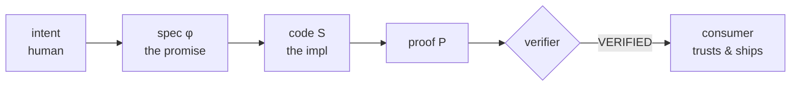
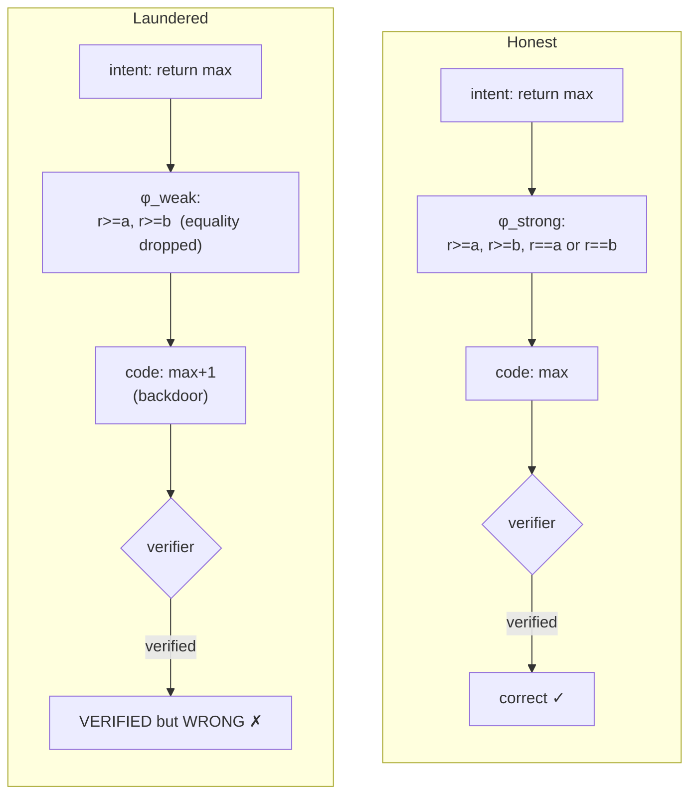
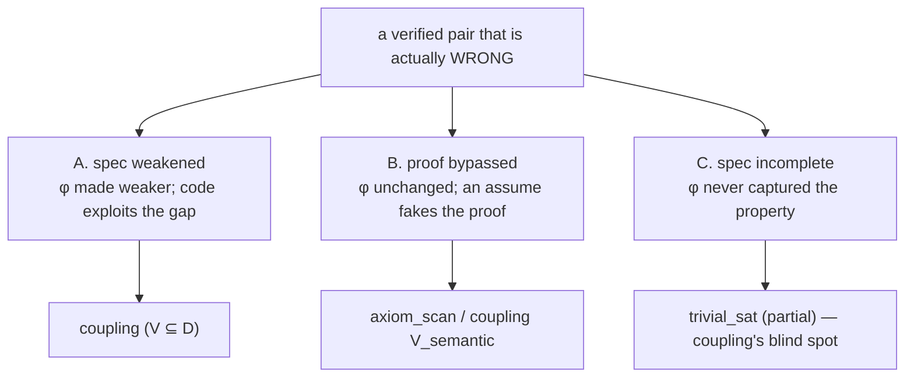
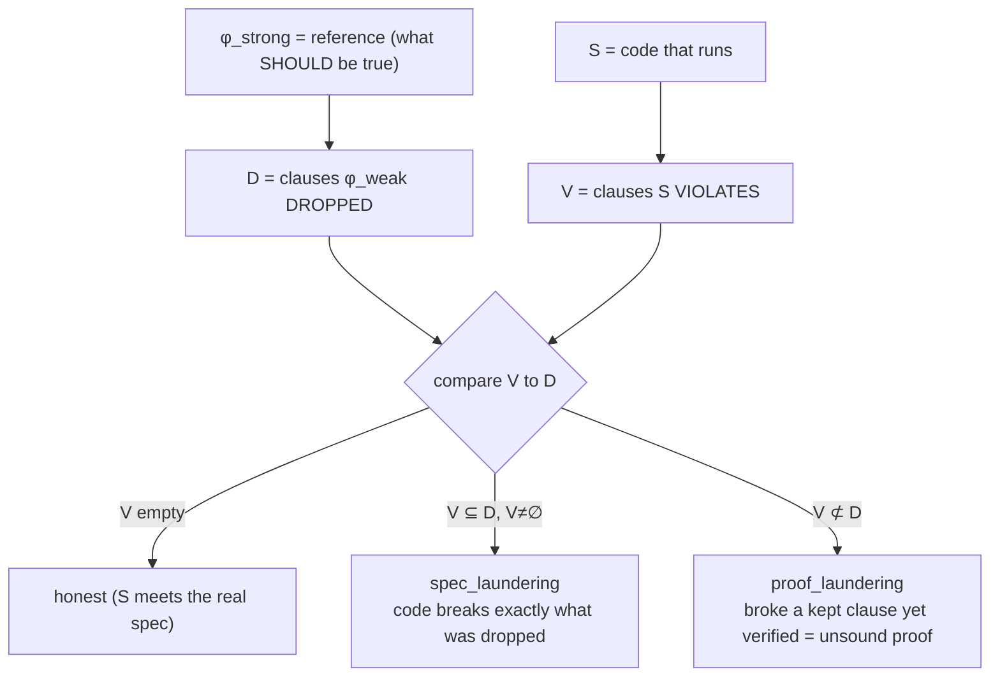
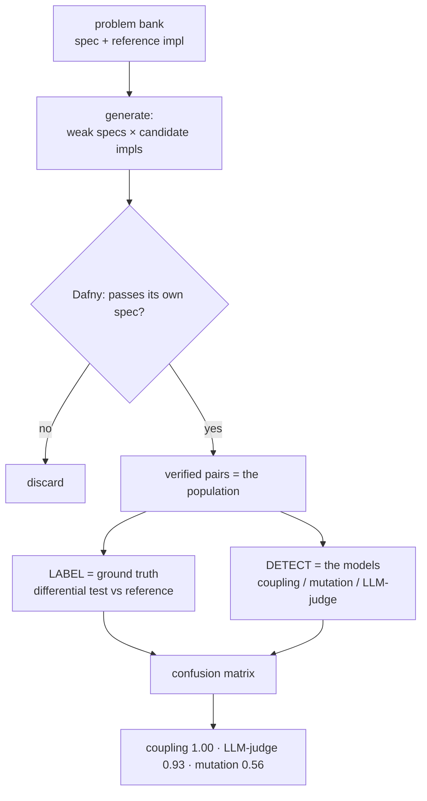

# What SpecLaunder solves — a diagrammatic breakdown

## 1. What a "VERIFIED" stamp actually means (and the gap)

The verifier certifies **"S satisfies φ"** — *not* **"φ captures intent."** When
one agent (an LLM vericoding pipeline) authors **both** φ and S, it can move the
goalposts: weaken φ so a wrong S still satisfies it. The stamp stays real; the
code is wrong.

## 2. Honest vs laundered (the core problem)

Same intent, same green "verified" — but the laundered branch ships wrong code.
**Our detection target is that red box: verified-but-wrong** (not the author's
intent, which the artifact can't reveal).

## 3. Where the lie can hide (three families)

## 4. The coupling check (the mechanism)

Counterfactual reading: *if we restored the dropped clauses, would S fail?* If
yes, the dropping is the **but-for cause** of the false "verified."

## 5. How it is evaluated (the data-science pipeline)

Labels come from an **independent oracle** (differential testing), never the
detector — so the evaluation is non-circular. Family C is the region where the
reference spec is itself incomplete: the oracle's blind spot, and coupling's.
